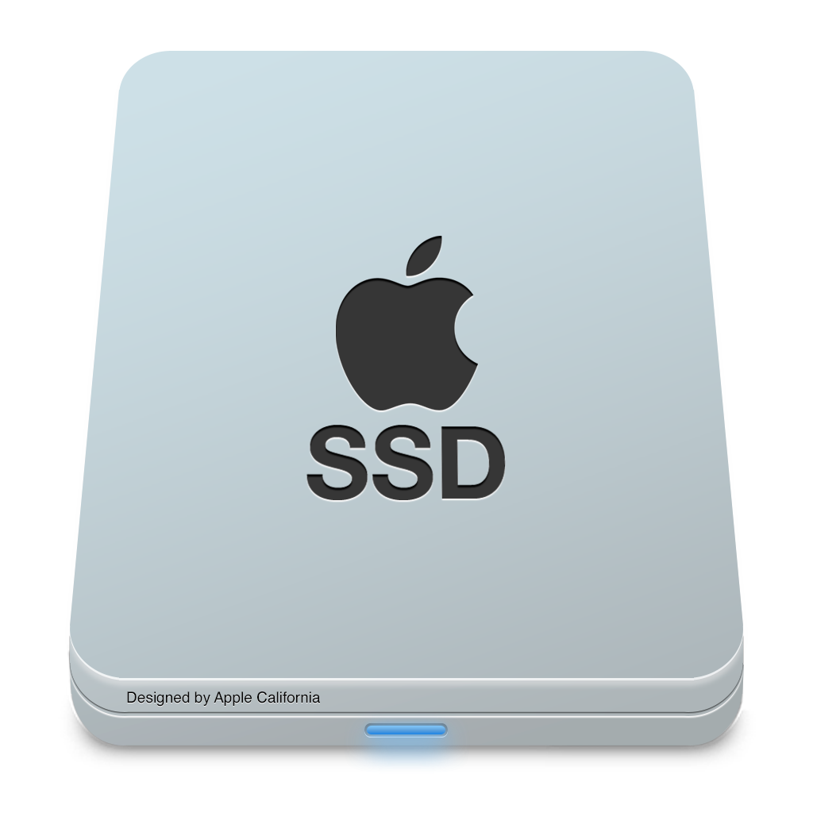

# Mac Disk Monitor

<p align="center">
  
</p>

Real-time disk usage monitor for macOS. Split into a small backend daemon that enumerates mounted volumes via `getfsstat(2)` (through [`sysinfo`](https://crates.io/crates/sysinfo)) and exposes an HTTP/SSE API, plus a native Swift menubar frontend that renders an icon (per-mount donut + label + percent inside) into `NSStatusItem`.

Same on-the-wire schema as the Linux [`disk_monitor`](https://github.com/maximofn/disk_monitor) sibling, just a different backend and a different port — both can run side by side on the same Mac (e.g. with an SSH tunnel into a Linux server).

## Architecture

```
+-------------------------+        HTTP/SSE         +----------------------------+
|   mac-disk-monitord     | <---------------------- |   Mac Disk Monitor.app     |
|   (sysinfo + walkdir)   |    /v1/stream JSON      |  (NSStatusItem + AppKit)   |
+-------------------------+                         +----------------------------+
        ^                                                       ^
        | getfsstat(2) (via sysinfo::Disks)                     | NSStatusBar
        | walkdir (largest files, opt-in)                       v
        v                                                  macOS menu bar
   XNU kernel
```

The Rust binaries live in a single Cargo workspace under `crates/`:

- `mac-disk-monitor-core` — shared `Snapshot` / `Mount` / `Usage` / `FileEntry` types serialised with `serde`. Identical to the Linux backend's schema so external consumers (Home Assistant, dashboards, etc.) work against either backend unchanged.
- `mac-disk-monitord` — backend daemon. Uses `sysinfo` to enumerate mounted volumes (filtering out the duplicate APFS system slices that share their backing storage with `/`) and `walkdir` for the optional largest-files scanner. Defaults to `127.0.0.1:9136`.

The macOS frontend lives in `front-mac/` as a Swift Package (Swift + AppKit + CoreGraphics, zero third-party deps). It consumes `/v1/stream` and renders into the menubar via `NSStatusItem`. Each mount is one block (`[icon] [short label] [donut with %]`); multiple mounts render side by side.

## Requirements

- macOS 13 or later (the Swift package targets `.macOS(.v13)`).
- Apple Silicon (`arm64`) or Intel (`x86_64`) — the backend is `sysinfo`-only, so no architecture-specific dependencies.
- **Rust toolchain ≥ 1.85** (stable). Install via [rustup](https://rustup.rs):
  ```bash
  curl --proto '=https' --tlsv1.2 -sSf https://sh.rustup.rs | sh
  source "$HOME/.cargo/env"
  ```
- **Swift 5.9+** (Xcode Command Line Tools): `xcode-select --install`.

No `sudo` is required at runtime: every data source used (`sysinfo::Disks` → `getfsstat(2)`, `walkdir`) works in user space. The optional largest-files scanner needs **Full Disk Access** (System Settings → Privacy & Security → Full Disk Access) to walk Documents/Desktop/Downloads and the privacy-protected `Library/...` directories — without it, those folders are silently skipped (same behaviour as `du` run unprivileged).

## Build

```bash
# Backend
cargo build --release --workspace
# → target/release/mac-disk-monitord

# Frontend
cd front-mac
./scripts/build-app.sh
# → front-mac/build/Mac Disk Monitor.app
```

## Run

In two terminals (or as services — see Autostart below):

```bash
./target/release/mac-disk-monitord --bind 127.0.0.1 --port 9136
open "front-mac/build/Mac Disk Monitor.app"
```

Or pass a custom backend URL explicitly:

```bash
"front-mac/build/Mac Disk Monitor.app/Contents/MacOS/mac-disk-monitor-tray" \
    --backend-url http://127.0.0.1:9136
```

### Daemon flags

| Flag | Default | Purpose |
|---|---|---|
| `--bind` | `127.0.0.1` | bind address (no auth, keep loopback) |
| `--port` | `9136` | HTTP port. Mac variants use the 9133-9136 band; Linux uses 9123-9126 — both can run side by side (e.g. with an SSH tunnel from a remote Linux host) |
| `--sample-interval-ms` | `1000` | sampler period |
| `--largest-top-n` | `20` | how many largest files to keep per mount |
| `--largest-refresh-secs` | `600` | seconds between full re-scans |
| `--largest-initial-delay-secs` | `60` | delay before first scan (gives TCC dialogs time to settle at login) |
| `--no-largest-files` | `true` | disable the largest-files scanner entirely. Default on macOS until you've granted Full Disk Access — pass `--no-largest-files=false` (or set `MAC_DISK_MONITORD_NO_LARGEST_FILES=false`) once granted |
| `--log-level` | `info` | also via `RUST_LOG` |

### Tray flags

`--backend-url`, `--icon-height`, `--dump-icon <path>` (renders one snapshot to PNG and exits — useful to inspect what the menubar receives without fighting AppKit), `--version`, `-h`.

### Quick API smoke test

```bash
curl -s http://127.0.0.1:9136/v1/snapshot | jq
curl -N http://127.0.0.1:9136/v1/stream         # SSE: one event per second
```

## API

| Endpoint | Purpose |
|---|---|
| `GET /healthz` | liveness |
| `GET /v1/info` | backend / kernel / mount-count metadata |
| `GET /v1/snapshot` | full latest snapshot (all mounts + their largest files) |
| `GET /v1/mounts` | mount summary (`mount_point` / `device` / `fs_type` / `total_bytes`) |
| `GET /v1/mounts/{path}` | full `Mount` object for a single mount |
| `POST /v1/rescan` | trigger a re-scan of every mount's largest files |
| `POST /v1/rescan/{path}` | trigger a re-scan of one mount |
| `GET /v1/stream` | SSE — one snapshot per event |

## Autostart on login

Two LaunchAgents live in `front-mac/scripts/`. Run from `front-mac/`:

```bash
./scripts/install-daemon.sh         # backend on login (port 9136, KeepAlive)
./scripts/install-launchagent.sh    # tray autostart on login
```

Logs land in `~/Library/Logs/mac-disk-monitord.{out,err}.log` and `~/Library/Logs/mac-disk-monitor-tray.{out,err}.log`. Pass `uninstall` to either script to remove its agent.

## Notes on the data source

- **Mount enumeration** uses `sysinfo::Disks::new_with_refreshed_list()`, which on Darwin wraps `getfsstat(2)`. Plug/unplug of an external drive between samples is reflected in the next snapshot without extra plumbing.
- **APFS volume dedup** — APFS containers expose multiple "volumes" backed by the same physical storage (`Preboot`, `VM`, `Update`, `Recovery`, …). After `/`, mounts whose device name we've already seen are dropped, and the `/System/Volumes/{Preboot,VM,Update,iSCPreboot,xarts,Hardware,Recovery}` paths are filtered explicitly. External mounts under `/Volumes/...` are kept.
- **Pseudo filesystems** (`devfs`, `autofs`, `ctl`, `fdesc`, `tmpfs`, `msdos` for the EFI System Partition) are filtered by `fs_type`. Zero-byte mounts (uninitialised volumes) are also dropped.
- **Largest files** uses `walkdir` with `same_file_system(true)` (does not descend into nested mounts) and de-duplicates hardlinks via `(dev, inode)`. Symlinks are not followed. EPERM/ENOENT errors during the walk are silently swallowed — same as `du`.

## Sister projects

Each one is its own repo so you can install only what your machine needs. Default ports:

| Resource | Linux | Mac |
|---|---|---|
| GPU | 9123 | 9133 |
| CPU | 9124 | [9134](https://github.com/maximofn/mac_cpu_monitor) |
| RAM | [9125](https://github.com/maximofn/ram_monitor) | [9135](https://github.com/maximofn/mac_ram_monitor) |
| **Disk** | [9126](https://github.com/maximofn/disk_monitor) | **9136** (this repo) |

## Support

If this is useful to you, consider giving a **☆ Star** to the repo, or invite me to a coffee:

[](https://www.buymeacoffee.com/maximofn)

## License

MIT — see `LICENSE`.
